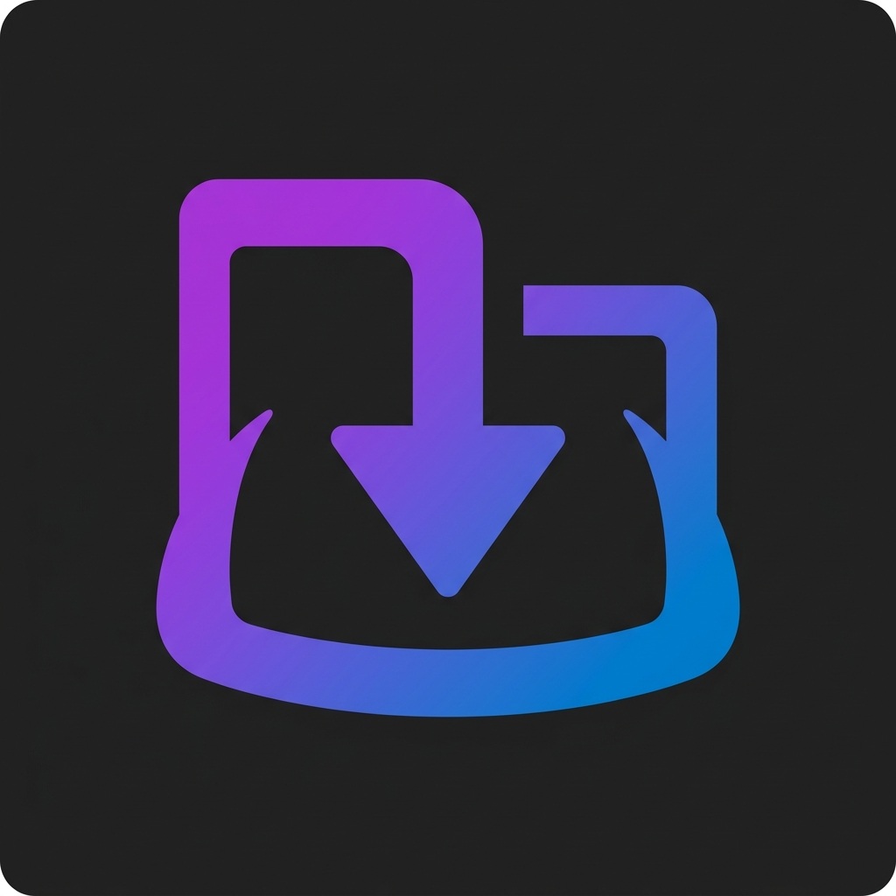

<div align="center">
  
  
  # Jellyfin Downloads Plugin
  
  **A powerful, fully-automated media scraping and downloading plugin for Jellyfin.**
</div>

## 🇮🇳 Built for Regional Audiences
This plugin is specifically optimized and hardcoded for Indian media consumers. The default scraping engine is deeply integrated with **1tamilmv**, providing robust, automated tracking and downloading of regional content (with extensive fallback capabilities to other sources). 

## 🌟 Features
* **Native C# Architecture**: Built entirely in C# for seamless integration into the Jellyfin server lifecycle. No external scripts or Python dependencies required!
* **Multi-Provider Cloud Orchestration**: Supports downloading torrents via both **Seedr** and **Torbox** APIs.
* **Smart Queueing System**: Never hit your cloud storage limits. The plugin automatically pools the sizes of active downloads and holds pending ones in a queue (e.g., respecting Seedr's 4GB limit).
* **Interactive UI**: Fully integrated into the Jellyfin web interface.
  * Real-time download progress overlays right on your movie posters!
  * Dedicated **History** panel in the plugin settings with live active, paused, and queued states.
  * Pause, Resume, and Cancel functionality directly from the UI.
* **Resilient Metadata**: Automatically saves `.nfo` metadata and poster locks before download completion to prevent Jellyfin from incorrectly re-identifying movies when replacing placeholder streams with real video files.
* **Robust Logging**: JSON-based history manager prevents SQL lock errors while maintaining a permanent record of all completed, failed, and canceled downloads.

---

## 🛠️ Installation

You can install this plugin natively directly from the Jellyfin Web UI using the Custom Repository feature.

1. Open your Jellyfin Web UI and navigate to **Dashboard** -> **Plugins**.
2. Click on the **Repositories** tab.
3. Click the **+ New Repository** button.
4. Fill in the details:
   * **Name**: `Downloads Plugin`
   * **Repository URL**: `https://raw.githubusercontent.com/Mohdsuhailpgdi/Jellyfin-Downloads-Plugin/main/manifest.json`
5. Click **Save**.
6. Switch to the **Catalog** tab on the top of the Plugins page.
7. Scroll down to the **General** section, find the **Downloads** plugin, and click **Install**.
8. **Restart your Jellyfin server** for the plugin to load.

---

## ⚙️ Configuration & Usage

Once the server is restarted and the plugin is loaded, you need to link it to your cloud downloading service.

1. Go to **Dashboard** -> **Plugins** and click on the **Downloads** plugin.
2. Enter your credentials for your preferred provider:
   * **Seedr**: Enter your Seedr Username and Password.
   * **Torbox**: Enter your Torbox API Key.
3. Click **Save**.

### How it Works
The plugin runs completely in the background via a Jellyfin Scheduled Task. 
* It automatically monitors your library for missing media.
* It scrapes *1tamilmv* (and fallbacks) to find magnets matching your movies.
* It sends the magnet to your cloud provider (Seedr/Torbox), waits for it to finish, and pulls the raw video file straight into your Jellyfin media folder.

### The History Tab
Inside the Plugin Settings page, you will see a **History** tab. This is your command center.
* View all **Active**, **Paused**, and **Queued** downloads.
* Monitor live download progress.
* **Pause / Resume / Cancel** any active download directly from the interface.

---

## 💻 Development

The plugin is compiled for `.NET 8.0` to match modern Jellyfin server versions.

```bash
dotnet build
```

After building, copy the `Jellyfin.Plugin.Downloads.dll` into your Jellyfin `/config/plugins/Downloads/` folder and restart the server.
